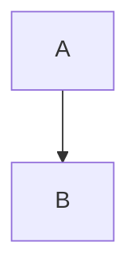

var config = {
    startOnLoad:true,
    theme: 'forest',
    flowchart:{
            useMaxWidth:false,
            htmlLabels:true
        }
};
mermaid.initialize(config);
window.mermaid.init(undefined, document.querySelectorAll('pre[lang=mermaid] > code'));

# parent-control

The internet is a wonderful source of great content, however it also comes with some risks. My kids are exposed to the web and I would like to get some control and minimize the risk of my kids exposed to porn, violence, bullying, hacking etc.

## Goal

Set up a raspberry pi to filter content, write reviews here.

## What is out there

### Pi-hole

https://pi-hole.net/

I tried this, looks nice, however it is tedious slow with https calls, and the pi needs to be restarted many times.

### PfBlocker-NG

I understood that this is more lightweight than pi-hole

https://docs.netgate.com/pfsense/en/latest/packages/pfblocker.html

### KeexyBox

https://keexybox.org/install/

This seems like just what I need.

### Others

- https://github.com/onnozweers/raspberry-pi-parental-filter
- Squid: https://wiki.squid-cache.org/SquidFaq/SquidAcl#Access_Controls_in_Squid
- nxfilter https://sidelink.co.za/install-nxfilter-on-raspberry-pi/

## Sources

https://www.vpngids.nl/veilig-internet/kind-en-jeugd/digitaal-ouderlijk-toezicht/

